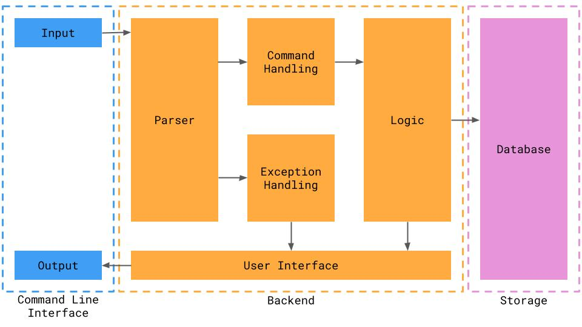
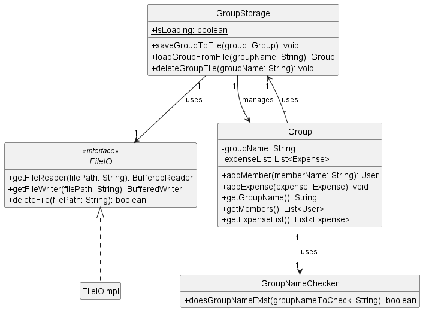
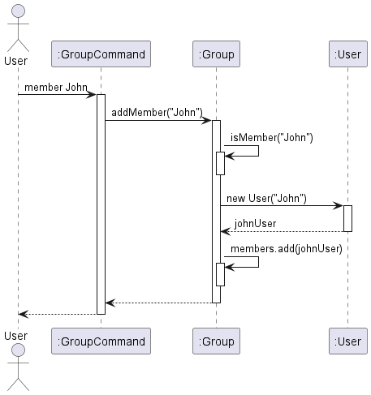
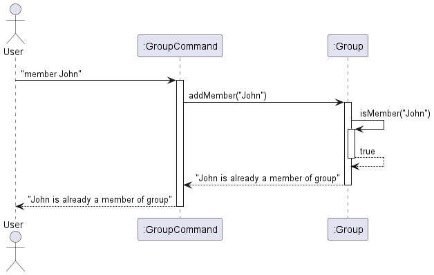
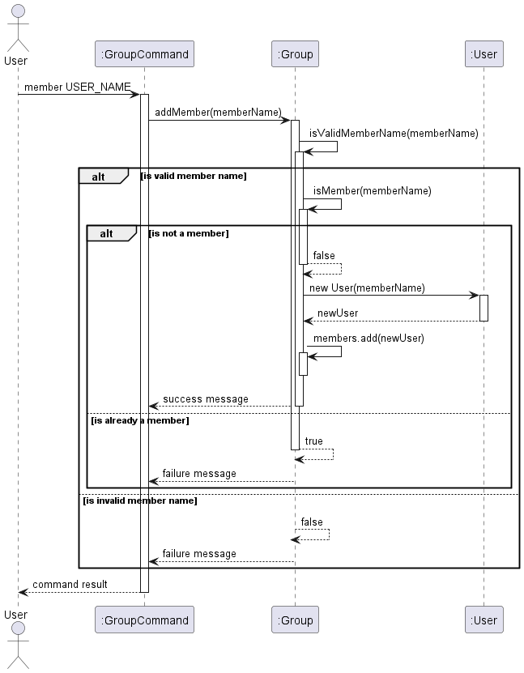
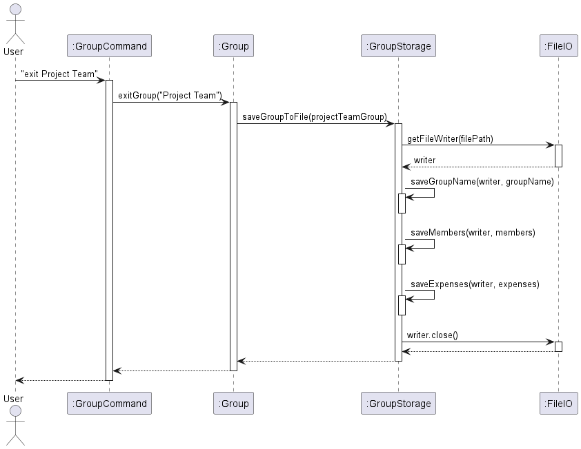
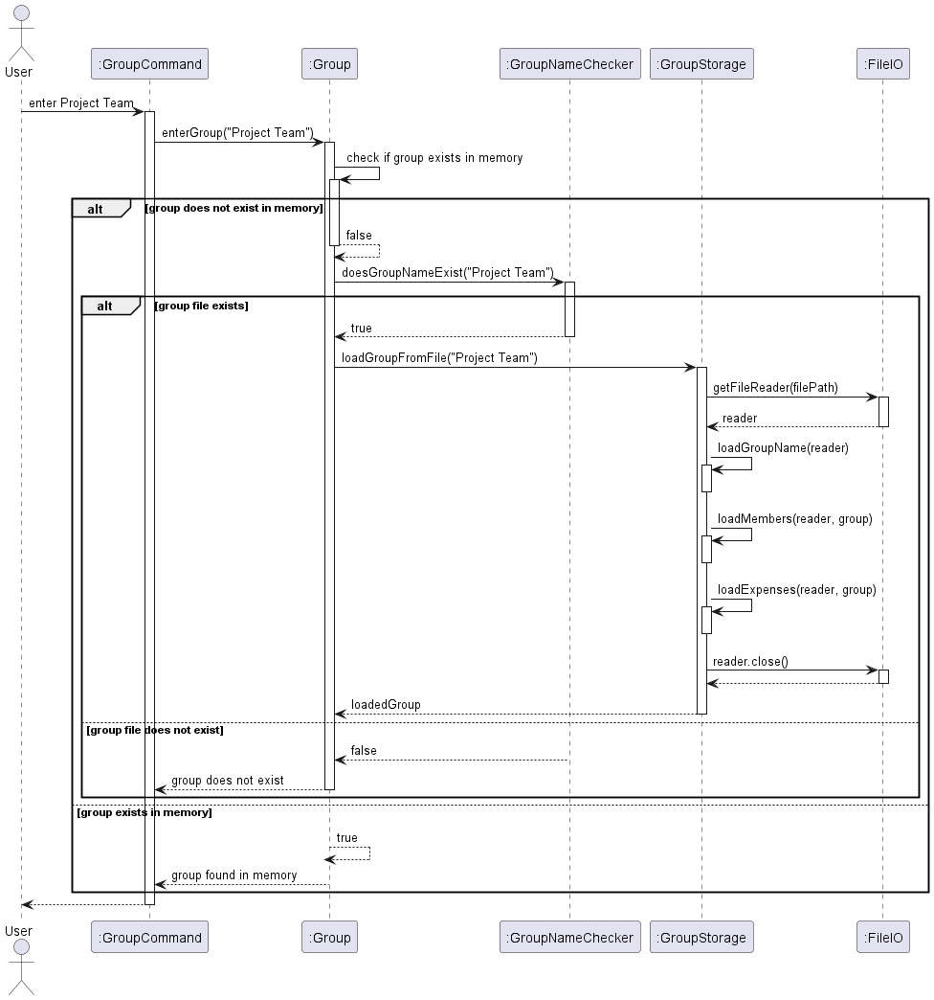
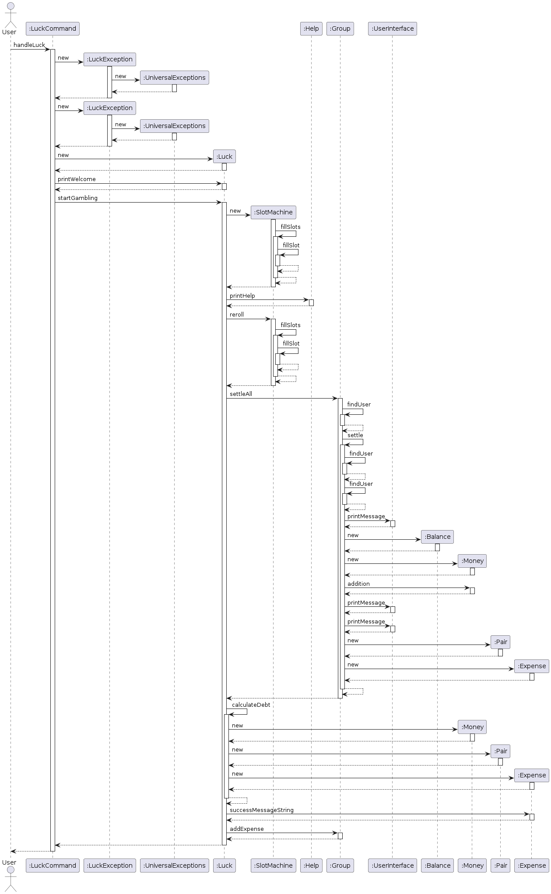

# Developer Guide

## Acknowledgements

We would like to acknowledge Splitwise for the inspiration for the project. The Splitwise application is a popular expense-sharing application that allows users to split bills and expenses with friends, family, and roommates. We have adapted the core features of Splitwise to create a simplified version of the application for our project. We would also like to acknowledge Shao Liang for the inspiration of the project's name.

## Design 

### Architecture

The high-level overview of the application is provided in the Architecture Diagram below.

Users interact with the application through the Command Line Interface. 
Application Storage is located in `/data/groups/` 
and each `Group` object is stored in its own `.txt` file after program's runtime. 



### Group Storage

The Group Storage feature allows users to save group information to files when exiting groups or ending the program. It also enables users to load group information from files when entering groups. This feature ensures that changes made to a group are persisted across sessions and that users can resume their interactions with groups seamlessly.

Below is the class diagram for the Group Storage feature:



The Group Storage feature:
- `GroupStorage` class: Responsible for saving and loading group information to and from files.
- `FileIO` interface: Defines the contract for file input/output operations.
- `FileIOImpl` class: Implements the `FileIO` interface for file input/output operations.
- `GroupNameChecker` class: Provides methods to check if a group file exists and to generate the file name for a group.
- `Group` class: Represents a group with members and expenses. It interacts with the `GroupStorage` class to save and load group information.
- `GroupFilePaths` class: Contains constants for file paths used by the `GroupStorage` feature.

The implementation of the Group Storage feature is covered in the next section.


## Implementation

### Help menu feature

#### Implementation

The "help" feature is facilitated by the  `Help` class.
It provides a static method `printHelp` to print out a guide on how to use the commands in the application.
`printHelp` can be used in the event the user issues an invalid command

### Group Creation feature

#### Implementation

The "Group Creation" feature is facilitated by the `Group` class. It provides methods to create a new group and manage
group membership. The implementation of this feature is as follows:

The Group class maintains a list of members as a `private List<User>` field called `members`.

The `createGroup(String groupName)` method is responsible for creating a new group. It performs the following steps:

1. Checks if a group with the given `groupName` already exists using the `isGroup(String groupName)` method.
2. If the group does not exist, creates a new `Group` object with the provided `groupName`.
3. Prints a success message indicating that the group has been created.
4. Adds the new `Group` object to the `groups` list.
5. Returns the newly created `Group` object.
6. If the group already exists, prints an error message indicating that the group already exists.

### Add Member to Group feature

#### Implementation

The "Add Member to Group" feature is facilitated by the `Group` class. It extends the `Group` class with methods to manage group membership and allows users to add new members to an existing group. Additionally, it implements the following operations:

- `Group#addMember(String memberName)` — Adds a new member to the group with the given `memberName`.
- `Group#isMember(String memberName)` — Checks if a user with the given `memberName` is already a member of the group.

These operations are exposed in the `GroupCommand` class as `GroupCommand#addMember(String memberName)`.

Given below is an example usage scenario and how the "Add Member to Group" feature behaves at each step.

Step 1. The user launches the application and enters a group named "Project Team" using the `group Project Team` command. The `Group` object for "Project Team" will be initialized with an empty `members` list.

Step 2. The user executes the `member John` command to add a new member named "John" to the "Project Team" group. The `member` command calls `GroupCommand#addMember("John")`, which in turn calls `Group#addMember("John")`. This operation checks if "John" is already a member of the group using `Group#isMember("John")`. Since "John" is not a member, a new `User` object with the name "John" is created and added to the `members` list of the "Project Team" group.



Step 3. The user executes the `member Emily` command to add another member named "Emily" to the "Project Team" group. Similar to step 2, the `member` command calls `GroupCommand#addMember("Emily")`, which then calls `Group#addMember("Emily")`. After checking that "Emily" is not already a member, a new `User` object with the name "Emily" is created and added to the `members` list of the "Project Team" group.

Step 4. The user tries to add "John" again to the "Project Team" group by executing the `member John` command. However, since "John" is already a member of the group, the `Group#isMember("John")` check in `Group#addMember("John")` returns `true`. As a result, an error message is displayed to the user, indicating that "John" is already a member of the group, and no duplicate member is added.



The following sequence diagram illustrates the flow of the "Add Member to Group" feature:




### Expenses feature

#### Implementation

The Expenses feature is facilitated through the Expense class. It allows users to add a new Expense through creation of
a new Expense object. Users can specify amount paid, the payee, and the members of the group involved in the
transaction.
Additionally, it implements the following operations:

+ `Expenses#payer()` - Gives the name of the member who paid for the expense
+ `Expenses#totalAmount()` - Returns the total amount of the expense
+ `Expenses#payees()` - Returns all the members involved in the transaction

These operations are exposed in the Expense class through the `getPayerName()`, `getTotalAmount()`, and `getPayees()`
functions respectively.

### Balance feature

#### Implementation

The Balance feature is facilitated through the Balance class.
It allows a user to view a printed list of other users in the Group, and the amount that is owed by/to each user.

Each `Balance` object contains a String of a user `userName`,
and a Map `balanceList`. This Map uses String of other users' usernames as Key, and
a Float of the amount that is owed by/to each user.

To print a user's Balance List, perform the following steps:

1. Create a `Balance` object with the params String `userName` and the current Group `group`.
2. From the `members` and `expenseList` List items in `group`, the Map `balanceList` is populated.
3. Call method `printBalance()` to print the contents of the Map `balanceList`.

### Settle feature

#### Implementation

The Settle feature is facilitated through the Settle class.
It allows a user to settle the debts between two users in a Group.

 The `Settle` class contains a `settleDebt(String userName1, String userName2)` method.
This method takes in two Strings `userName1` and `userName2` as parameters, representing the two users to settle the
debt between.

The method then prints out the amount that is owed by `userName1` to `userName2`, and the amount that is owed
by `userName2` to `userName1`.  It then prints out the total amount that is owed between the two users, and prompts the user to enter the amount to
settle the debt.

The method then prints out the amount that is owed by `userName1` to `userName2`, and the amount that is owed
by `userName2` to `userName1` after the settlement.

### Group Storage feature

#### Implementation

The "Group Storage" feature is facilitated by the `GroupStorage` class. It extends the functionality of the `Group` class by providing methods to save and load group information to and from files. The `GroupStorage` class interacts with the `FileIO` interface for file input/output operations. Additionally, it implements the following key operations:

- `GroupStorage#saveGroupToFile(Group group)` — Saves the group information to a file when a user exits a group or ends the program.
- `GroupStorage#loadGroupFromFile(String groupName)` — Loads the group information from a file when a user enters a group.

These operations are invoked from the `Group` class when the user performs specific actions related to groups.

Given below is an example usage scenario and how the "Group Storage" feature behaves at each step.

Step 1. The user launches the application and tries to create a group named "Project Team" using the `create Project Team` command. The `Group#getOrCreateGroup(String groupName)` method is called to retrieve or create the group.

Step 2. Inside the `Group#getOrCreateGroup(String groupName)` method, it checks if the group already exists in memory. If not, it uses the `GroupNameChecker` class to check if the group file exists. If the group file doesn't exist, a new `Group` object is created, and the user is placed in the newly created group.

Step 3. The user executes various commands to add members and expenses to the "Project Team" group. These changes are made to the `Group` object in memory.

Step 4. The user executes the `exit Project Team` command to exit the "Project Team" group. This command invokes the `Group#exitGroup(String groupName)` method, which in turn calls the `GroupStorage#saveGroupToFile(Group group)` method to save the current state of the "Project Team" group to a file. The saving process includes writing the group name, members, and expenses to the file in a structured format.



Step 5. Later, the user decides to enter the "Project Team" group again using the `enter Project Team` command. The `Group#enterGroup(String groupName)` method is called to enter the group.

Step 6. Inside the `Group#enterGroup(String groupName)` method, it first checks if the group exists in memory. If not, it uses the `GroupNameChecker` class to check if the group file exists. If the group file exists, it invokes the `GroupStorage#loadGroupFromFile(String groupName)` method to load the group information from the file.



The `GroupStorage#loadGroupFromFile(String groupName)` method reads the group information from the file, creates a new `Group` object, and populates it with the loaded data. This includes the group name, members, and expenses. The loaded `Group` object is then returned to the `Group` class.

Step 7. The user continues to interact with the "Project Team" group, making changes to its members and expenses. These changes are made to the loaded `Group` object in memory.

Step 8. When the user ends the program using the `bye` command, the `GroupStorage#saveGroupToFile(Group group)` method is invoked again to save the current state of all loaded groups to their respective files. This ensures that any changes made during the session are persisted.

**Design Considerations:**

- **Alternative 1 (current choice):** Saving group information to files when exiting groups or ending the program, and loading group information when entering groups.
  - Pros: Minimizes file I/O operations and reduces the overhead of constantly saving and loading group information. 
  - Cons: Changes made to a group are not persisted until the user explicitly exits the group or ends the program.
- **Alternative 2:** Saving group information after every command that modifies the group, and loading group information whenever a group is accessed. 
  - Pros: Ensures that changes are immediately persisted and reduces the risk of data loss in case of unexpected program termination. 
  - Cons: Increases file I/O operations and may impact performance, especially for frequent group modifications.

### Luck feature

#### Implementation

The Luck features offers users the unique opportunity to clear their debts by playing with a slot machine.
User enters the command `luck` in the parser to enter the slot machine game. 
Parser checks whether the user is in a group and also whether the said group has more than one user. 
To win in the slot machine, all three slots in the MIDDLE row must show the same character
The user can either key in `/reroll` or `/exit` to either roll the slot machine or leave the game.
For every new `/reroll`, an additional Expense of 10USD would be created and allocated to a random member in the group 
For a win, the user clears all his debts within the group.
Following sequence diagram shows user calls `startGambling()` within Luck class and a new SlotMachine class is instantiated
For every reroll, fillSlots() is called which fills individual slots in the 3 x 3 slot machine with a randomised character



## Product scope

### Target user profile

Our target users are people who share expenses with friends, family, roommates, or colleagues.

The application gives an accurate and simple way to represent unsettled debts between users and their friends

### Value proposition

Our application provides a simple and efficient way for users to manage shared expenses with friends, family, or colleagues. It allows users to create groups, add members to groups, and split expenses accurately among group members. The application helps users keep track of their debts and settle them easily. By automating the process of splitting expenses and tracking debts, the application saves users time and effort, making it a valuable tool for managing shared expenses. Users that are able to type fast and are familiar with the command line interface will find this application useful.

## User Stories

| Version | As a ... | I want to ...                                                  | So that I can ...                                           |
|---------|----------|----------------------------------------------------------------|-------------------------------------------------------------|
| v1.0    | new user | see usage instructions                                         | refer to them when I forget how to use the application      |
| v1.0    | user     | add a new expense with description, amount, and users involved | split the expense equally                                   |
| v1.0    | user     | create a new group                                             | split expenses with different groups                        |
| v1.0    | user     | add a new member to a group                                     | split expenses with different members in the group           |
| v1.0    | user     | check how much I owe each member in the group                  | keep track of my debts                                      |
| v2.0    | user     | settle debts between two users in the group                    | clear debts between users                                   |
| v2.0    | user | save group information to files when exiting groups or ending the program | resume interactions with groups seamlessly |
| v2.0    | user | load group information from files when entering groups | resume interactions with groups seamlessly |
| v2.1 | user | add expenses in different currencies | split expenses accurately in different currencies |

## Non-Functional Requirements

1. **Performance**: The application should respond to user commands within a reasonable time frame, even when handling large amounts of data.
2. **Reliability**: The application should be robust and handle errors gracefully, providing informative error messages to users.
3. **Usability**: The application should have a user-friendly interface that is easy to navigate and understand.
4. **Portability**: The application should be platform-independent and run on different operating systems without requirements for additional software. 

## Glossary

- **Group**: A collection of users who share expenses and debts with each other.
- **User**: An individual who is a member of a group and participates in sharing expenses.
- **Expense**: A transaction involving a group of users where one user pays for an expense that is shared among multiple users.
- **Balance**: The amount of money that a user owes or is owed by other users in a group.
- **Settle**: The process of clearing debts between two users in a group.
- **Group Storage**: The feature that allows users to save and load group information to and from files.
- **Currency**: A system of money used in a particular country or region.
- **Debt**: An amount of money that is owed by one user to another user in a group.

## Instructions for manual testing

{Give instructions on how to do a manual product testing e.g., how to load sample data to be used for testing}

Important note: The provided test cases are independent of each other and can be run in any order. Test cases that require multiple steps are clearly outlined with the expected outcomes at each step. All test cases are designed to be run on a clean slate, i.e., without any existing groups or expenses in the system.


### Test Case: Help Menu

1. Run the application.
2. Enter the `help` command.
3. Verify that the help menu is displayed with a list of available commands and their descriptions.

Expected outcome: The help menu is displayed with a list of available commands and their descriptions as shown below:

```
Welcome, here is a list of commands:
help: Access help menu.
create <name>: Create a group.
exit <name>: Exit current group.
member <name> : Add a member to the group.
expense <description> /amount <amount> /currency <currency> /paid <paid_by> /user <user_1> /user <user_2> ...: Add an expense SPLIT EQUALLY.
expense <description> /unequal /amount <amount> /currency <currency> /paid <paid_by> /user <user_1> <amount_owed> /user <user_2> <amount owed> ...: Add an expense SPLIT UNEQUALLY.
list: List all expenses in the group.
balance <user_name>: Show user's balance.
settle <payer_name> /user <payee_name>: Settle the amount between two users.
luck <payer_name>: luck is in the air tonight
```

### Test Case: Group Creation

1. Run the application.
2. Enter the `create Project Team` command.
3. Verify that a new group named "Project Team" is created successfully.

Expected outcome: A success message is displayed indicating that the group "Project Team" has been created.

```
Project Team created.
You are now in Project Team.
```

### Test Case: Add Member to Group

1. Run the application.
2. Enter the `create Project Team` command.
3. Enter the `member John` command.
4. Enter the `member Emily` command.
5. Enter the `member John` command again.
6. Verify the output messages at each step.

Expected outcome:
- Step 2: A success message is displayed indicating that the group "Project Team" has been created.
```
Project Team created.
You are now in Project Team.
```
- Step 3: A success message is displayed indicating that the member "John" has been added to the group.
```
John has been added to Project Team.
```

- Step 4: A success message is displayed indicating that the member "Emily" has been added to the group.
```
Emily has been added to Project Team.
```
- Step 5: An error message is displayed indicating that the member "John" is already a member of the group.
```
John is already a member of Project Team.
```

### Test Case: Add Expense

1. Run the application.
2. Enter the `create Project Team` command.
3. Enter the `member John` and `member Emily` commands.
4. Add an expense to the "Project Team" group using the `expense Dinner /amount 100 /paid John /user Emily` command.
5. Verify the output messages at each step.

Expected outcome: A success message is displayed indicating that the expense "Dinner" has been added to the group with the correct details.

```
Added new expense with description Dinner and amount SGD 100.00 paid by John. The split is:
Emily : SGD 50.00
John : SGD 50.00
```

### Test Case: Save and Load Group Information

1. Run the application.
2. Create a new group named "Family" using the `create Family` command.
3. Add members "Alice" and "Bob" to the "Family" group using the `member Alice` and `member Bob` commands.
4. Add an expense to the "Family" group using the `expense Dinner /amount 50 /paid Alice /user Bob` command.
5. Exit the "Family" group using the `exit Family` command.
6. Exit the application using the `bye` command.
7. Run the application again.
8. Enter the `enter Family` command.
9. Verify that the group "Family" is loaded with the members "Alice" and "Bob" and the expense "Dinner" with the correct details.

Expected outcome:
- Step 2: A success message is displayed indicating that the group "Family" has been created.
```
Family created.
You are now in Family.
```
- Step 3: Success messages are displayed indicating that the members "Alice" and "Bob" have been added to the group.
```
Alice has been added to Family.
Bob has been added to Family.
```
- Step 4: A success message is displayed indicating that the expense "Dinner" has been added to the group.
```
Added new expense with description Dinner and amount SGD 50.00 paid by Alice. The split is:
Bob : SGD 25.00
Alice : SGD 25.00
```
- Step 5: A success message is displayed indicating that the group "Family" has been saved to a file.
```
Group data saved successfully.
You have exited Family.
```
- Step 8: A success message is displayed indicating that the group "Family" has been entered.
```
Group loaded successfully.
You are now in Family.
```

