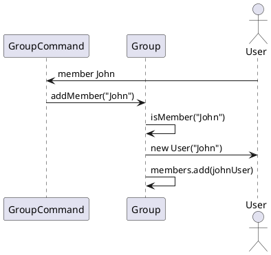
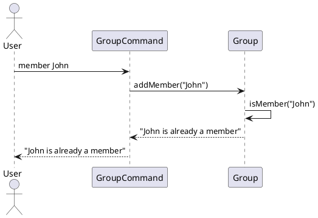
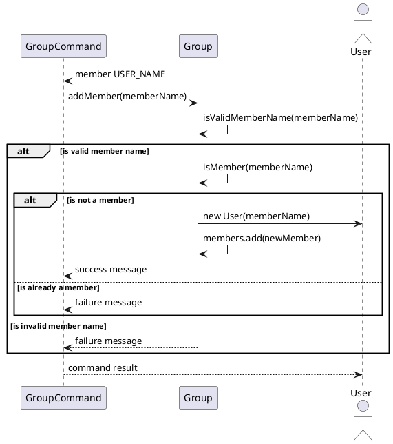
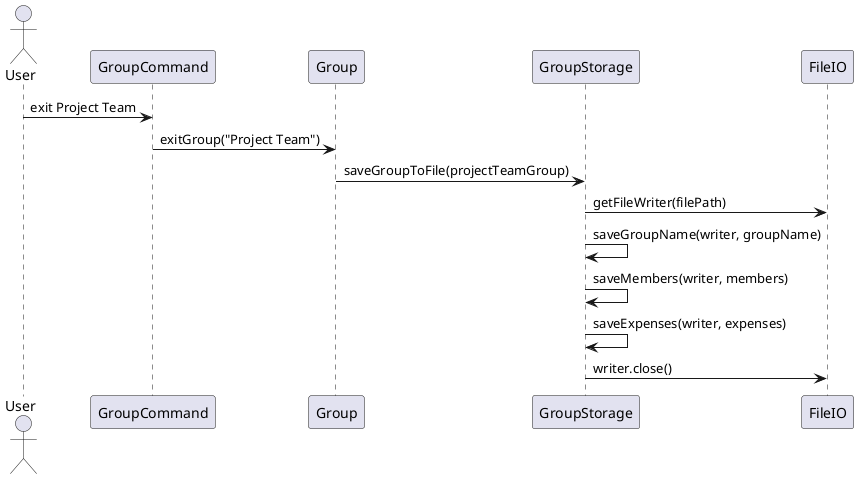
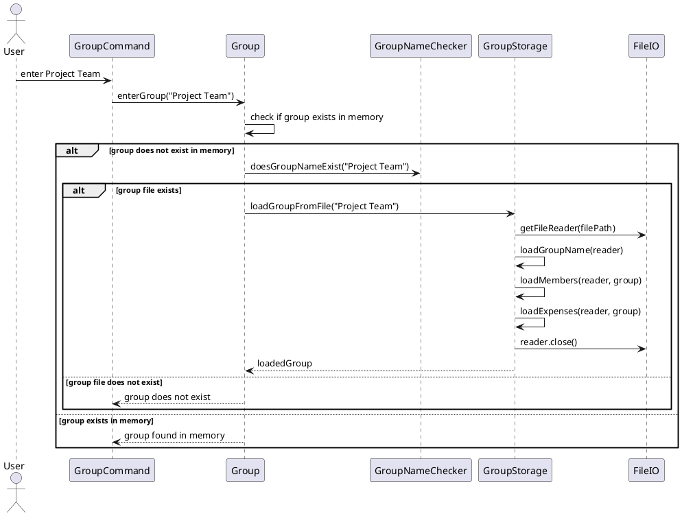

# Developer Guide

## Acknowledgements

{list here sources of all reused/adapted ideas, code, documentation, and third-party libraries -- include links to the
original source as well}

## Design & implementation

{Describe the design and implementation of the product. Use UML diagrams and short code snippets where applicable.}

### Help menu feature

#### Implementation

The "help" feature is facilitated by the  `Help` class.
It provides a static method `printHelp` to print out a guide on how to use the commands in the application.
`printHelp` can be used in the event the user issues an invalid command

### Group Creation feature

#### Implementation

The "Group Creation" feature is facilitated by the `Group` class. It provides methods to create a new group and manage
group membership. The implementation of this feature is as follows:

The Group class maintains a list of members as a `private List<User>` field called `members`.

The `createGroup(String groupName)` method is responsible for creating a new group. It performs the following steps:

1. Checks if a group with the given `groupName` already exists using the `isGroup(String groupName)` method.
2. If the group does not exist, creates a new `Group` object with the provided `groupName`.
3. Prints a success message indicating that the group has been created.
4. Adds the new `Group` object to the `groups` list.
5. Returns the newly created `Group` object.
6. If the group already exists, prints an error message indicating that the group already exists.

### Add Member to Group feature

#### Implementation

The "Add Member to Group" feature is facilitated by the `Group` class. It extends the `Group` class with methods to manage group membership and allows users to add new members to an existing group. Additionally, it implements the following operations:

- `Group#addMember(String memberName)` — Adds a new member to the group with the given `memberName`.
- `Group#isMember(String memberName)` — Checks if a user with the given `memberName` is already a member of the group.

These operations are exposed in the `GroupCommand` class as `GroupCommand#addMember(String memberName)`.

Given below is an example usage scenario and how the "Add Member to Group" feature behaves at each step.

Step 1. The user launches the application and enters a group named "Project Team" using the `group Project Team` command. The `Group` object for "Project Team" will be initialized with an empty `members` list.

Step 2. The user executes the `member John` command to add a new member named "John" to the "Project Team" group. The `member` command calls `GroupCommand#addMember("John")`, which in turn calls `Group#addMember("John")`. This operation checks if "John" is already a member of the group using `Group#isMember("John")`. Since "John" is not a member, a new `User` object with the name "John" is created and added to the `members` list of the "Project Team" group.

Step 3. The user executes the `member Emily` command to add another member named "Emily" to the "Project Team" group. Similar to step 2, the `member` command calls `GroupCommand#addMember("Emily")`, which then calls `Group#addMember("Emily")`. After checking that "Emily" is not already a member, a new `User` object with the name "Emily" is created and added to the `members` list of the "Project Team" group.

Step 4. The user tries to add "John" again to the "Project Team" group by executing the `member John` command. However, since "John" is already a member of the group, the `Group#isMember("John")` check in `Group#addMember("John")` returns `true`. As a result, an error message is displayed to the user, indicating that "John" is already a member of the group, and no duplicate member is added.

The following sequence diagram illustrates the flow of the "Add Member to Group" feature:

[//]: # (![Sequence Diagram]&#40;AddMember.png&#41;)

### Expenses feature

#### Implementation

The Expenses feature is facilitated through the Expense class. It allows users to add a new Expense through creation of
a new Expense object. Users can specify amount paid, the payee, and the members of the group involved in the
transaction.
Additionally, it implements the following operations:

+ `Expenses#payer()` - Gives the name of the member who paid for the expense
+ `Expenses#totalAmount()` - Returns the total amount of the expense
+ `Expenses#payees()` - Returns all the members involved in the transaction

These operations are exposed in the Expense class through the `getPayerName()`, `getTotalAmount()`, and `getPayees()`
functions respectively.

### Balance feature

#### Implementation

The Balance feature is facilitated through the Balance class.
It allows a user to view a printed list of other users in the Group, and the amount that is owed by/to each user.

Each `Balance` object contains a String of a user `userName`,
and a Map `balanceList`. This Map uses String of other users' usernames as Key, and
a Float of the amount that is owed by/to each user.

To print a user's Balance List, perform the following steps:

1. Create a `Balance` object with the params String `userName` and the current Group `group`.
2. From the `members` and `expenseList` List items in `group`, the Map `balanceList` is populated.
3. Call method `printBalance()` to print the contents of the Map `balanceList`.

### Settle feature

#### Implementation

The Settle feature is facilitated through the Settle class.
It allows a user to settle the debts between two users in a Group.

 The `Settle` class contains a `settleDebt(String userName1, String userName2)` method.
This method takes in two Strings `userName1` and `userName2` as parameters, representing the two users to settle the
debt between.

The method then prints out the amount that is owed by `userName1` to `userName2`, and the amount that is owed
by `userName2` to `userName1`.  It then prints out the total amount that is owed between the two users, and prompts the user to enter the amount to
settle the debt.

The method then prints out the amount that is owed by `userName1` to `userName2`, and the amount that is owed
by `userName2` to `userName1` after the settlement.

### Group Storage feature

#### Implementation

The "Group Storage" feature is facilitated by the `GroupStorage` class. It extends the functionality of the `Group` class by providing methods to save and load group information to and from files. The `GroupStorage` class interacts with the `FileIO` interface for file input/output operations. Additionally, it implements the following key operations:

- `GroupStorage#saveGroupToFile(Group group)` — Saves the group information to a file when a user exits a group or ends the program.
- `GroupStorage#loadGroupFromFile(String groupName)` — Loads the group information from a file when a user enters a group.

These operations are invoked from the `Group` class when the user performs specific actions related to groups.

Given below is an example usage scenario and how the "Group Storage" feature behaves at each step.

Step 1. The user launches the application and tries to create a group named "Project Team" using the `create Project Team` command. The `Group#getOrCreateGroup(String groupName)` method is called to retrieve or create the group.

Step 2. Inside the `Group#getOrCreateGroup(String groupName)` method, it checks if the group already exists in memory. If not, it uses the `GroupNameChecker` class to check if the group file exists. If the group file doesn't exist, a new `Group` object is created, and the user is placed in the newly created group.

Step 3. The user executes various commands to add members and expenses to the "Project Team" group. These changes are made to the `Group` object in memory.

Step 4. The user executes the `exit Project Team` command to exit the "Project Team" group. This command invokes the `Group#exitGroup(String groupName)` method, which in turn calls the `GroupStorage#saveGroupToFile(Group group)` method to save the current state of the "Project Team" group to a file. The saving process includes writing the group name, members, and expenses to the file in a structured format.

Step 5. Later, the user decides to enter the "Project Team" group again using the `enter Project Team` command. The `Group#enterGroup(String groupName)` method is called to enter the group.

Step 6. Inside the `Group#enterGroup(String groupName)` method, it first checks if the group exists in memory. If not, it uses the `GroupNameChecker` class to check if the group file exists. If the group file exists, it invokes the `GroupStorage#loadGroupFromFile(String groupName)` method to load the group information from the file.

The `GroupStorage#loadGroupFromFile(String groupName)` method reads the group information from the file, creates a new `Group` object, and populates it with the loaded data. This includes the group name, members, and expenses. The loaded `Group` object is then returned to the `Group` class.

Step 7. The user continues to interact with the "Project Team" group, making changes to its members and expenses. These changes are made to the loaded `Group` object in memory.

Step 8. When the user ends the program using the `bye` command, the `GroupStorage#saveGroupToFile(Group group)` method is invoked again to save the current state of all loaded groups to their respective files. This ensures that any changes made during the session are persisted.

**Design Considerations:**

- **Alternative 1 (current choice):** Saving group information to files when exiting groups or ending the program, and loading group information when entering groups.
  - Pros: Minimizes file I/O operations and reduces the overhead of constantly saving and loading group information. 
  - Cons: Changes made to a group are not persisted until the user explicitly exits the group or ends the program.
- **Alternative 2:** Saving group information after every command that modifies the group, and loading group information whenever a group is accessed. 
  - Pros: Ensures that changes are immediately persisted and reduces the risk of data loss in case of unexpected program termination. 
  - Cons: Increases file I/O operations and may impact performance, especially for frequent group modifications.

## Product scope

### Target user profile

{Describe the target user profile}
Our target users are people who share expenses with friends, family, roommates, or colleagues.
The application gives an accurate and simple way to represent unsettled debts between users and their friends

### Value proposition

{Describe the value proposition: what problem does it solve?}

## User Stories

| Version | As a ... | I want to ...                                                  | So that I can ...                                           |
|---------|----------|----------------------------------------------------------------|-------------------------------------------------------------|
| v1.0    | new user | see usage instructions                                         | refer to them when I forget how to use the application      |
| v1.0    | user     | add a new expense with description, amount, and users involved | split the expense equally                                   |
| v1.0    | user     | create a new group                                             | split expenses with different groups                        |
| v1.0    | user     | list all expenses within a group                               | see recent transactions                                     |
| v1.0    | user     | check how much I owe each member in the group                  | keep track of my debts                                      |
| v2.0    | user     | find a to-do item by name                                      | locate a to-do without having to go through the entire list |

## Non-Functional Requirements

{Give non-functional requirements}

## Glossary

* *glossary item* - Definition

## Instructions for manual testing

{Give instructions on how to do a manual product testing e.g., how to load sample data to be used for testing}
